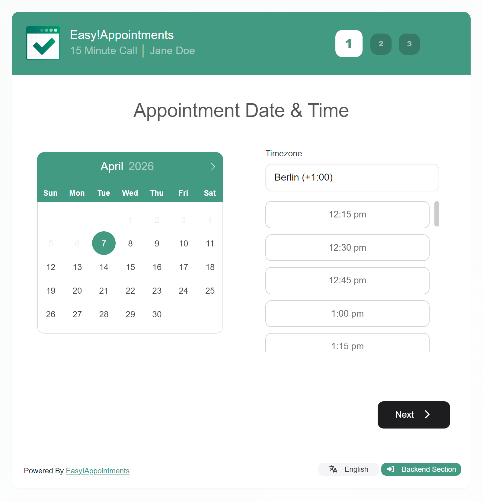

<h1 align="center">
    <br>
    <a href="https://easyappointments.org">
        
    </a>
    <br>
    Easy!Appointments
    <br>
</h1>

<h4 align="center">
    A powerful, self-hosted appointment scheduling platform built for flexibility.
</h4>

<p align="center">
  
  
  
  <a href="https://discord.com/invite/UeeSkaw">
    
  </a>
</p>

<p align="center">
  <a href="#why-easyappointments">Why Easy!Appointments</a> •
  <a href="#features">Features</a> •
  <a href="#quick-start">Quick Start</a> •
  <a href="#installation">Installation</a> •
  <a href="#license">License</a>
</p>

---

<p align="center">
  <strong>Looking for advanced capabilities?</strong><br>
  Explore premium features and professional services at
  <a href="https://easyappointments.org/premium" target="_blank">easyappointments.org/premium</a>.
</p>

---



## Why Easy!Appointments

**Easy!Appointments** is an open-source scheduling system that gives you full control over your booking workflow.

It is designed to adapt to your business — whether you need simple appointment booking or more advanced scheduling logic.

**Key advantages:**

* Fully self-hosted — your data stays under your control
* Highly customizable and flexible
* Integrates with your existing website and database
* Free for both personal and commercial use


## Features

Built to support a wide range of scheduling needs:

* Appointment and customer management
* Service and provider organization
* Working plans and booking rules
* Google Calendar synchronization
* Email notification system
* Multi-language interface
* Self-hosted deployment
* Active open-source community


## Quick Start (Development)

Clone and run the project locally:

```bash
# Clone the repository
git clone https://github.com/alextselegidis/easyappointments.git

# Navigate into the project
cd easyappointments

# Install dependencies
npm install && composer install

# Start development watcher
npm start
```

Build production assets:

```bash
npm run build
```

> Note: Works on Windows (WSL recommended) and Docker-based setups.


## Installation (Production)

### Requirements

* Apache or Nginx
* PHP 8.2+
* MySQL database

### Steps

1. Create a database (or use an existing one)
2. Upload the `easyappointments` folder to your server
3. Ensure the `storage` directory is writable
4. Rename `config-sample.php` to `config.php`
5. Update configuration values
6. Open the application in your browser and follow the setup wizard

Once completed, the system is ready to use.


## Resources

* Website: https://easyappointments.org
* Issues: https://github.com/alextselegidis/easyappointments/issues
* Support Group: https://groups.google.com/forum/#!forum/easy-appointments
* Discord: https://discord.com/invite/UeeSkaw


## License

* Code: GPL v3.0
* Content: CC BY 3.0


## Author

* Website: https://alextselegidis.com
* GitHub: https://github.com/alextselegidis
* Twitter: https://twitter.com/AlexTselegidis

---

## More Projects

* [Plainpad · Self-Hosted Note Taking](https://github.com/alextselegidis/plainpad)
* [Clientverse · CRM Application](https://github.com/alextselegidis/clientverse)
* [Timecrack · Time Tracking](https://github.com/alextselegidis/timecrack)
